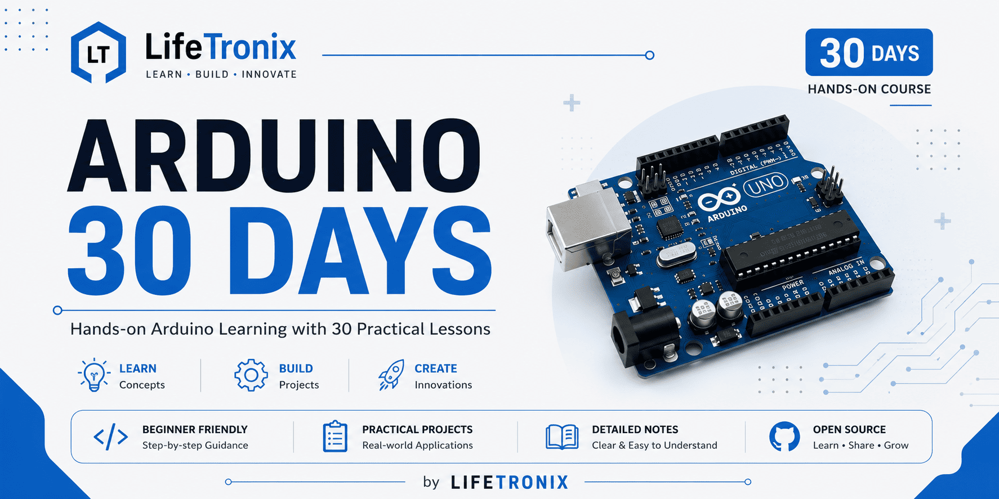

<p align="center">
  
</p>

# Arduino 30 Days

A complete beginner-friendly Arduino UNO course designed to help you learn embedded systems, electronics, and robotics through hands-on projects.

> 🚀 Developed by **LifeTronix**

---

## 📚 Course Overview

This repository contains a structured 30-day Arduino UNO course. Each lesson includes:

- Arduino source code
- Circuit diagrams
- Components list
- Project images
- Beginner-friendly explanations
- Practical challenges

---

## 🚧 Course Status

**Currently in Progress**

---

# 📅 Course Roadmap

| Day | Lesson | Status |
|-----|--------|--------|
| Day 01 | Blink LED | ✅ |
| Day 02 | Push Button | ✅ |
| Day 03 | LED Brightness (PWM) | ⏳ |
| Day 04 | RGB LED | ⏳ |
| Day 05 | Buzzer | ⏳ |
| Day 06 | Serial Monitor | ⏳ |
| Day 07 | Traffic Light Project | ⏳ |

> More lessons will be added as the course progresses.

---

# 📁 Repository Structure

```text
arduino-30-days
│
├── assets/
├── course/
│   ├── Day-01-Blink-LED/
│   ├── Day-02-Push-Button/
│   └── ...
├── docs/
├── resources/
├── LICENSE
└── README.md
```


